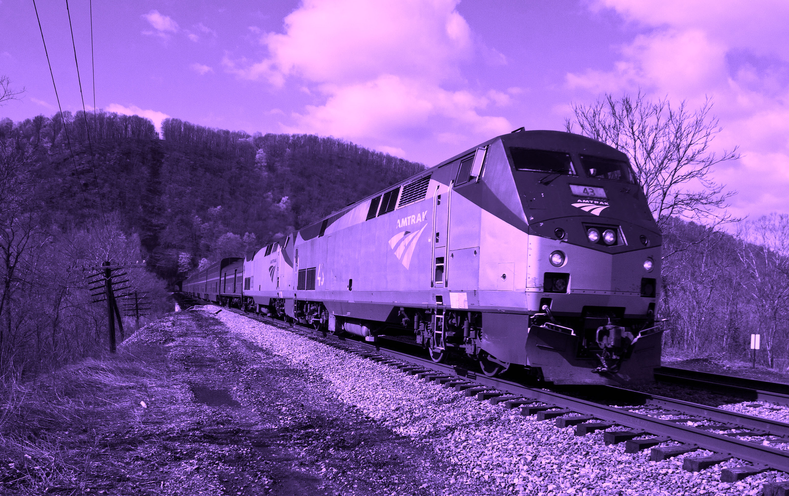

## Game v3

[Untitled Game] is a semi-fictional interactive whirlwind.



## Getting started

1. Install dependences
```bash
$ yarn install
```

2. Start Development Server
```bash
$ yarn start
```

By default, you can view the game at `localhost:3000` unless this port is already taken, in which vase, `create-react-app` will prompt you to confirm use of another port.

3. (Optional) Start Storybook
You can view game components in isolation in the storybook. This is great for developing components without having to navigate to the page/state they are present.

```bash
$ yarn run storybook
```

You can see the story book at `localhost:9009`.

## TODO
### Page 1
- [x] add more dummy modules to the computer screen
- [ ] add voicemail playing/finished animation
- [x] add second color animation to dream text
- [ ] absolute position things on the computer screen
- [ ] full screen the computer screen when active
- [ ] gray out the computer screen when typing in the AIM box

### Page 2
- [ ] initial showing state is messed up
- [ ] add some sort of train animation
  - what about a drawn window with whooooshing real image background?
- [ ] sunshine in your face could be a gif that loads quickly in full screen style, which could really be you pointing your phone at the sun.
- [ ] break up larger blocks of text
- [ ] spacing issues with dialogue

### Page 3
- [ ] click through the dialogue
- [ ] shake memory text
- [ ] style reaction decision
- [ ] work on magical history explanation + add dialogue of your reactions and them not listening
- [ ] now is a good time to style all `Next` buttons

### Page 4
- [ ] clicking turns the screen black, text to white
- [ ] `bursts with light` shows video of a train with volume
- [ ] Councils' words may be good full screen takeover

### Page 5
- [ ] birthday party stock footage
- [ ] little more text and dialogue needed
- [ ] create PosterAnimation from LG suggestions or things
- [ ] magic cord animation
- [ ] memory wipe
- [ ] detailed dialogue and text needed

### Miscellaneous
- [ ] upgrade to react 16 for better modals + render array, better performance too
- [ ] localstorage saving state
- [ ] block URL routes if haven't played that far (or createMemoryHistory)

- [ ] block smaller screens :shrug:
  - [ ] Use an HOC, similar to scrollTop, to do this

### 🍒
- [ ] music
- [ ] make badge downloadable
